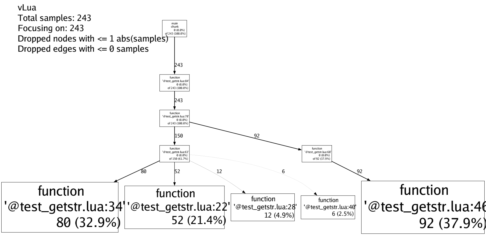

# vLua

[](https://github.com/esrrhs/vLua)
[](https://github.com/esrrhs/vLua)

Lua 虚拟机 C 函数级采样分析工具

## 简介
把 Lua VM 内部 C 函数（如 `luaH_getshortstr`、`luaH_newkey`、`internshrstr` 等）的 CPU 消耗**精确归因到 Lua 源码行**，并输出完整调用栈。

perf 能看到 `luaH_getshortstr` 占 13% CPU，但看不到是哪些 Lua 代码在贡献这 13%。vLua 解决的就是这个问题。

## 特性
- **精准**，SIGPROF 定时采样 + PC 范围判断，只在目标 C 函数执行时捕获 Lua 调用栈
- **轻量**，100Hz 采样下 overhead ≈ 0.03%，可长期常开
- **安全**，signal handler 内就地解析，ring buffer 只存值类型不存指针；SIGSEGV trampoline 兜底，热更期间不会崩
- **兼容**，输出 [pLua](https://github.com/esrrhs/pLua) 格式的 .pro 文件，可直接用 pprof、[火焰图](https://github.com/brendangregg/FlameGraph) 工具链分析
- **灵活**，目标函数名作为参数传入，可以分析任意 Lua VM 内部 C 函数

## 编译
```shell
./build.sh
```
输出 `bin/libvlua.so` 及 `tools/vlua`、`tools/png`。

## 使用
```lua
local v = require "libvlua"

-- 参数1：要采样的 C 函数名
-- 参数2：采样结果文件（pLua 兼容的二进制格式）
v.start("luaH_getshortstr", "call.pro")

do_some_thing()

-- 结束采样，返回文本摘要报告
local text = v.stop()
print(text)
```

## 生成可视化结果
```shell
cd tools
./show.sh ../test
```
或手动：
```shell
./vlua -i call.pro -pprof call.prof
./pprof --collapsed call.prof 2>/dev/null > call.fl
./flamegraph.pl call.fl > call.svg
```

## 示例

模拟 table get-by-string 热点场景（深嵌套 `player.role.battle.stat.kill` 等链式访问），采样 `luaV_execute`：

#### 调用图


#### `v.stop()` 返回的文本摘要
```
Top hotspots (source:line -> count, pct of analysable)
   count       pct  location
     100    38.46%  @test_getstr.lua:36     -- update_kill: player.role.battle.stat.kill = ...
      50    19.23%  @test_getstr.lua:24     -- calc_damage: player.role.battle.weapon.damage = ...
      36    13.85%  @test_getstr.lua:49     -- update_pos: player.role.pos.x = ...
      34    13.08%  @test_getstr.lua:48     -- update_pos: 循环入口
      12     4.62%  @test_getstr.lua:30     -- calc_ammo: player.role.battle.weapon.ammo = ...
      10     3.85%  @test_getstr.lua:42     -- update_death: player.role.battle.stat.death = ...
      ...
```

## 注意事项
- 二进制不要 `strip`，`luaH_getshortstr` 等 static 符号只在 `.symtab` 中
  - 验证：`nm <binary> | grep luaH_getshortstr`
- 热更期间可以常开，不会崩（三层防护：值类型 Sample + 指针校验 + SIGSEGV trampoline）
- 当前假设单 Lua VM（`g_L`），多 lua_State 场景需要扩展

## 其他
[lua全家桶](https://github.com/esrrhs/lua-family-bucket)

