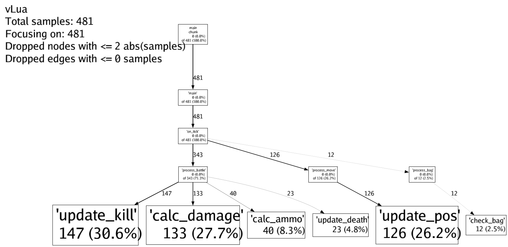

# vLua

[English](README.md) | [中文说明](README_CN.md)

[](https://github.com/esrrhs/vLua)
[](https://github.com/esrrhs/vLua)
[](https://github.com/esrrhs/vLua/actions)

Attribute Lua VM C-function CPU time back to Lua source lines.

## Overview

`perf` can show that `luaH_getshortstr` costs 13% CPU, but not **which Lua lines** contribute that 13%. **vLua** samples only while a chosen Lua VM C function is on CPU, then attributes those samples to Lua source locations with full call stacks.

## Features

- **Precise**: SIGPROF sampling + PC-range filter — capture Lua stacks only when the target C function is executing
- **Lightweight**: ~0.03% overhead at 100Hz — safe to leave on in production
- **Safe**: signal-handler parses stacks in place; ring buffer stores value types only; SIGSEGV trampoline covers hot-reload races
- **Compatible**: writes [pLua](https://github.com/esrrhs/pLua)-format `.pro` files for pprof / [FlameGraph](https://github.com/brendangregg/FlameGraph)
- **Flexible**: target C function name is a parameter — profile any Lua VM internal

## Build

vLua vendors **Lua 5.3.6** headers (private VM structs). CMake extracts `dep/lua-5.3.6.tar.gz` automatically.

```shell
./build.sh
# or:
cmake -B build -DCMAKE_BUILD_TYPE=Release
cmake --build build
```

Outputs:

- `bin/libvlua.so` — sampler shared library
- `bin/vlua` — profile converter (if Go is available)
- `build/lua/lua53` — matching Lua 5.3.6 interpreter for tests

## Test

```shell
ctest --test-dir build --output-on-failure
```

Or run a script directly with the vendored interpreter:

```shell
cd test
../build/lua/lua53 test_getstr.lua
```

## Usage

### Embed in Lua

```lua
local v = require "libvlua"

-- Arg 1: Lua VM C function to sample
-- Arg 2: output .pro file (pLua-compatible)
v.start("luaH_getshortstr", "call.pro")

do_some_thing()

-- Stop sampling; returns a text hotspot summary
local text = v.stop()
print(text)
```

### Inject with [hookso](https://github.com/esrrhs/hookso)

```shell
# a) Get lua_State* (e.g. first arg of lua_settop in xxx.so)
./hookso arg $PID xxx.so lua_settop 1
# => 123456

# b) Load libvlua.so
./hookso dlopen $PID ./libvlua.so

# c) Start: lrealstart(L, "luaH_getshortstr", "./call.pro")
./hookso call $PID libvlua.so lrealstart i=123456 s="luaH_getshortstr" s="./call.pro"

# d) Stop: lrealstop(L)
./hookso call $PID libvlua.so lrealstop i=123456
```

## Visualization & Tools

The `tools/` directory converts `.pro` profile data into FlameGraph SVGs and call graph images.

### Prerequisites (Optional)

- **FlameGraph**: `show.sh` fetches `flamegraph.pl` from GitHub if not found locally or in `PATH`. On CentOS/RHEL you may need `yum install perl-open`.
- **Graphviz** (call graph PNG): `sudo apt install graphviz` / `sudo yum install graphviz`
- **pprof** (call graph DOT/PNG): `sudo apt install google-perftools` / `sudo yum install gperftools`

### Generate Visualizations

```shell
cd tools
./show.sh ../test
```

This generates:

- `<name>.fl`: Folded stack traces
- `<name>.svg`: Interactive SVG flame graph
- `<name>.prof`: Symbolized pprof profile
- `<name>.dot`: Graphviz call graph
- `<name>.png`: Rendered PNG call graph (if graphviz and pprof are installed)

`show.sh` looks for `bin/vlua` (built by CMake) or builds `tools/vlua` via Go on demand.

## Example

Simulated table get-by-string hotspots (nested `player.role.battle.stat.kill` chains), sampling `luaH_getshortstr`:

#### Call graph



#### Text summary from `v.stop()`

```
Top hotspots (source:line -> count, pct of analysable)
   count       pct  location
     152    31.67%  @test_getstr.lua:24     -- calc_damage: player.role.battle.weapon.damage = ...
     131    27.29%  @test_getstr.lua:36     -- update_kill: player.role.battle.stat.kill = ...
      63    13.12%  @test_getstr.lua:49     -- update_pos: player.role.pos.y = ...
      57    11.88%  @test_getstr.lua:48     -- update_pos: player.role.pos.x = ...
      ...
```

## Notes

- Do **not** strip the host binary — static symbols like `luaH_getshortstr` live in `.symtab`  
  Verify: `nm <binary> | grep luaH_getshortstr`
- Safe during hot-reload (value-type samples + pointer checks + SIGSEGV trampoline)
- Currently assumes a single Lua VM (`g_L`); multi-`lua_State` needs extension
- Headers / test interpreter are Lua **5.3.6**; host process must use a matching 5.3.x VM layout

## Related

[lua-family-bucket](https://github.com/esrrhs/lua-family-bucket) · [pLua](https://github.com/esrrhs/pLua) · [hookso](https://github.com/esrrhs/hookso)

## License

MIT
